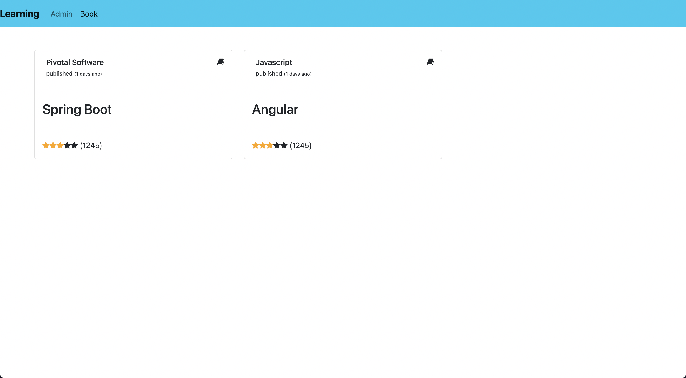
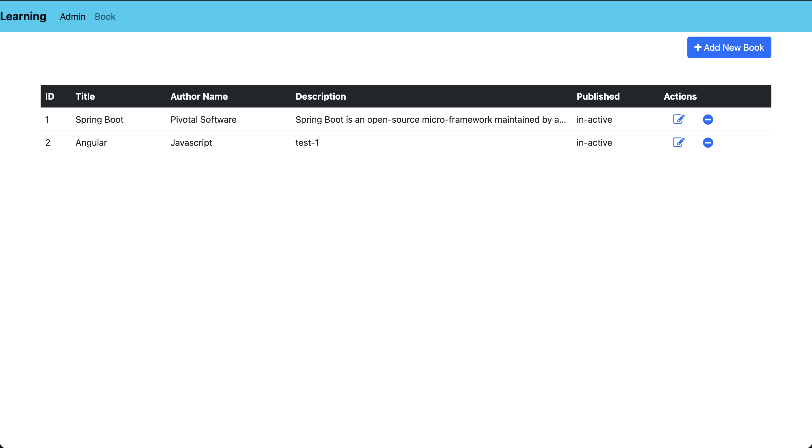

### LearningAngular

#### 1. Angular Routing
Angular routing where router enables navigation detecting change in browser URL as an instruction to change the view.

<details>
 <summary>Click to view Routing</summary>


#####  Generate Components

```
ng g components home-page

ng g components projects

```

#####  Create an AppRouting module in the `/app`

```
ng g or generate module app-routing --module app --flat
```


#####  Add Router Outlet `src/app/app.component.html`

```
<h1>Angular Router</h1>
<nav>
  <a routerLink="/crisis-center" routerLinkActive="active">Crisis Center</a>
  <a routerLink="/heroes" routerLinkActive="active">Heroes</a>
</nav>
<router-outlet></router-outlet>
```

#####  Create `PageNotFoundComponent` to display when users visit invalid URLs.

ng g component page-not-found

src/app/page-not-found.component.html(404 component)
```
<h2>Page not found</h2>

```

#####  Create `app-routing` module to contain the routing configuration.

ng g module  app-routing --module app --flat

src/app/app-routing.module.ts

```
import { NgModule } from '@angular/core';
import { RouterModule, Routes } from '@angular/router';

import { HomePageComponent } from './home-page/home-page.component';
import { ProjectsComponent } from './projects/projects.component';
import { PageNotFoundComponent } from './page-not-found/page-not-found.component';

const appRoutes: Routes = [
  { path: 'home-page', component: HomePageComponent },
  { path: 'projects', component: ProjectsComponent },
  { path: '', redirectTo: '/home-page', pathMatch: 'full' },
  { path: '**', component: PageNotFoundComponent }
]
@NgModule({
  declarations: [],
  imports: [
    RouterModule.forRoot(
      appRoutes,
      { enableTracing: true }
    )
  ],
  exports: [
    RouterModule
  ]
})
export class AppRoutingModule { }
```

#####  Update the `AppRoutingModule` in the imports array

```
import { BrowserModule } from '@angular/platform-browser';
import { NgModule } from '@angular/core';

import { AppComponent } from './app.component';
import { AppRoutingModule } from './app-routing.module';
import { HomePageComponent } from './home-page/home-page.component';
import { ProjectsComponent } from './projects/projects.component';
import { PageNotFoundComponent } from './page-not-found/page-not-found.component';

@NgModule({
  declarations: [
    AppComponent,
    HomePageComponent,
    ProjectsComponent,
    PageNotFoundComponent
  ],
  imports: [
    BrowserModule,
    AppRoutingModule
  ],
  providers: [],
  bootstrap: [AppComponent]
})
export class AppModule { }
```

</details>

#### 2. Components And Templates
* Components are the building block of any angular application.
* A well designed UI should break it's rendering into different components where each component renders the particular portion of the UI.
* it more manageable and also the same components can be reused.

<details>
<!-- after summary  and close details need an empty line -->
<summary>Click to view Components</summary>

#####  Generate `Component`

```
ng generate component < component_name >

or

ng g c < component_name >
```

##### Create `Component` manually
Navigate to your project directory and folder like `src/app`

Create a new file like, `<component-name>.components.ts`

* `home-page.component.ts`      -> This is the class where code for the component is written in `TypeScript`.
* `home-page.component.html`    -> This is component template, written in `HTML`.
* `home-page.component.css`     -> The components private `CSS` styles.
* `home-page.component.spec.ts` -> Defines a unit test for the home-page component.


#####  HomePageComponent

```
import { Component, OnInit } from '@angular/core';

@Component({
  selector: 'app-home-page',
  templateUrl: './home-page.component.html',
  styleUrls: ['./home-page.component.scss']
})
export class HomePageComponent implements OnInit {

  componentName = "Home Page"
  constructor() { }

  ngOnInit() {
  }

}
```

#####  Tempates and Views

Define a components view with it's companion template.
A template is a form of `HTML` that tells angular how to render the component

#####  Template syntax

A template looks like regular HTML
The HTML based on your application's logic and the state of application and DOM data.

</details>

<d>

#### 3. Directives

* Angular directives are classes that add additional behavior to elements in your Angular applications.
* Using directives you can change the appearance or behavior of an element, change the DOM layout by adding and removing DOM elements.

<details>
<!-- after summary  and close details need an empty line -->
<summary>Click to view Directives</summary>

Types of directives in Angular:

 1. Components:
      * Components are directives only difference with other directives is that components are a directive with a template.
      * Components are a directive with a template that means you will create a TypeScript class that is decorated with a @Component decorator and an accompanying template (html) file.
 
 2. Attribute directives:
      * Attribute directives are used to change the appearance or behavior of an element, component, or another directive.


    Built-in attribute directives:

    1. NgClass
        * ngClass directive you can dynamically add or remove CSS classes for a DOM element.
        * With ngClass the CSS classes can be provided in one of the following ways-

        String:
        * The CSS classes listed in the string (space delimited) are added.

        ```html
        <div [ngClass]="'first second'">Directive String</div>
        ```

        Array:
        * The CSS classes declared as Array elements are added.

        ```html
        <div [ngClass]="['first', 'second']">Directive Array</div>
        ```

        Object:
        
        * As a key, value pair where keys are CSS classes and values are conditions.
        * CSS classes get added when the expression given in the value evaluates to a truthy value, otherwise they are removed.

        ```html
        <div [ngClass]="{'first': true, 'second': true, 'third': false}">Directive Object</div>
        ```
    2. NgStyle:
        * ngStyle directive you can set the CSS properties for the containing HTML element.

        ```html
        <h2 [ngStyle]="{'font-size.px': 30, 'text-align': 'center'}">{{componentName}} works!</h2>
        ```

    3. NgModel:
        * Used to add two-way data binding to an HTML form element.

      3.1 Two-Way Data Binding:
        
        * two-way data binding in Angular using ngModel directive.
        * From component (Type Script code) to template (HTML view) in the form of String interpolation, property binding.

        Syntax of Angular two-way binding:

          ```
          [( )] = BANANA IN A BOX
          ```

        add `FormsModule` to app.module.ts
        ```
        @NgModule({
          declarations: [
            AppComponent,
            HomePageComponent,
            ProjectsComponent,
            PageNotFoundComponent
          ],
          imports: [
            BrowserModule,
            AdminModule,
            AppRoutingModule,
            FormsModule
          ],
          providers: [],
          bootstrap: [AppComponent]
        })
        ```
        example:

          ```html
            <input class="form-control" [(ngModel)]="userName" placeholder="userName">

            <span>{{ userName }}</span>
          ```
   

 3. Structural Directives 
    * Structural directives will change the structure of the DOM by removing or adding elements. 
    * Structural directives in Angular can be easily identified because these directives always start with an asterisk (*)

    1. NgIf:
        * ngIf directive is used to conditionally include or remove an element in the HTML document.

        * In the component there is a boolean flag and the element is displayed in the template based on whether the boolean flag is true or false.

        Angular ngIf example to display element:

        ```html
          toggle : boolean = true
          onClickToggle(){
            this.toggle = !this.toggle;
          }
          <p *ngIf="toggle">This text is displayed conditionally using ngIf</p>
        ```
        
        Comparison (===) using ngIf:

        * ngIf for comparing variables, if comparison returns true element is displayed otherwise it is not displayed.

        example: 
        ```
         <p *ngIf="show === 'yes'">This text is displayed conditionally using ngIf</p>
        ```

        ngIf with else:

        * else block with if making it if-else conditional statement where if block is executed when the conditional expression resolves to true and else block is executed if expression is false.

        example:
        ```
          <div *ngIf="show; else elseBlock">This text is displayed when condition is true</div>
          <ng-template #elseBlock>This text is displayed when condition is false.</ng-template>
        ```

        ngIf with then and else:

        * both then and else block with ngIf. Then part is executed if the condition is true, else block is executed otherwise.

        ```
        <div *ngIf="show; then thenBlock else elseBlock"></div>
        <ng-template #thenBlock>This text is displayed when condition is true.</ng-template>
        <ng-template #elseBlock>This text is displayed when condition is false.</ng-template>
        ```

    2. NgFor:
        * Angular ngFor directive is the looping directive in Angular that repeats a node for each item in a list.

        example:
        ```
        <tr *ngFor="let project of projects">
        <td>{{project.id}}</td>
        <td>{{project.product_name}}</td>
        <td>{{project.product_type}}</td>
        </tr>
        ```
    
    3. NgSwitch:
        * It specifies an expression to match against and displays one element from among several possible elements, based on a switch condition.
        * NgSwitch is a set of three directives: NgSwitch, NgSwitchCase, NgSwitchDefault.

</details>


#### 4. Pipes
* Using Angular pipes you can transform data like strings, currency amounts, dates, many other values for display.
* You can use pipe symbol (|) for Angular pipes and syntax is as follows

<details>
<!-- after summary  and close details need an empty line -->
<summary>Click to view Pipes</summary>


Syntax:

```
value_expression | Angular pipe
```

Example:
```
{{ name | uppercase}}

```

Types of Pipes:

AsyncPipe:
  * Additive operator (also used for String concatenation
* CurrencyPipe:
  * Transforms a number to a currency string
DatePipe:
  * Formats a date value according to locale rules.
DecimalPipe:
  * Transforms a decimal number into a string, formatted according to locale rules
I18nPluralPipe:
  * Maps a value to a string that pluralizes the value according to locale rules.
I18nSelectPipe:
  * Generic selector that displays the string that matches the current value.
JsonPipe:
  * Converts a value into its JSON-format representation. Useful for debugging.
KeyValuePipe:
  * Transforms Object or Map into an array of key value pairs.
LowerCasePipe:
  * Transforms text to all lower case.
PercentPipe
  * Transforms a number to a formatted percentage string.
SlicePipe:
  * Creates a new Array or String containing a subset (slice) of the elements.
TitleCasePipe:
  * Transforms text to title case. Capitalizes the first letter of each word and transforms the rest of the word to lower case.
UpperCasePipe:
  * Transforms text to all upper case.

</details>

ng g c components/book/book-details  
npm install angular-notifier






